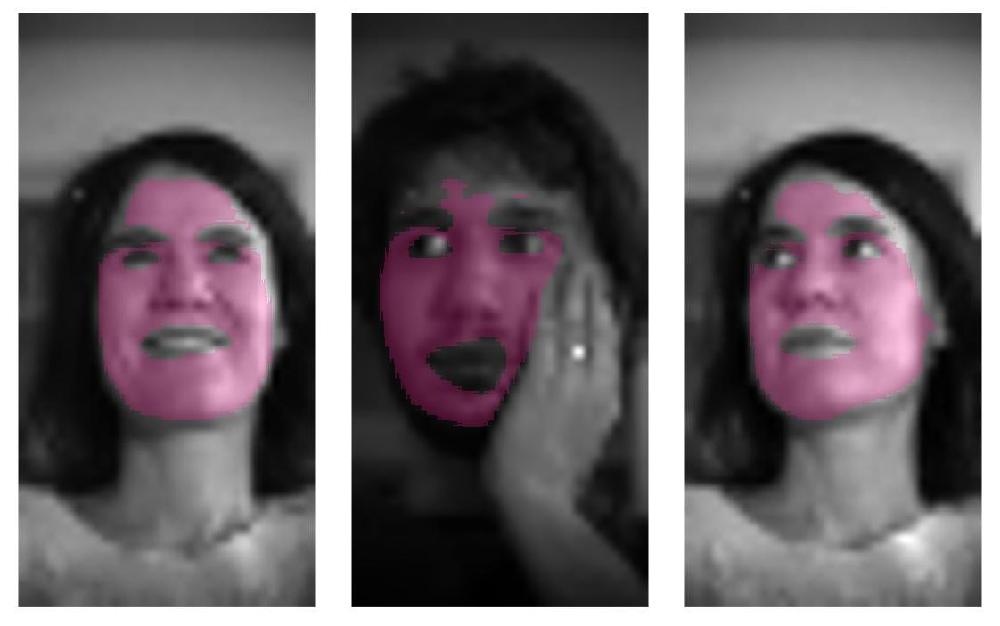

# Deep Skin Detection on Low Resolution Grayscale Images




This project presents a facial skin detection method, based on a deep learning architecture,  that is able to precisely associate a skin label to each pixel of a given image depicting a face. This is an important preliminary step in many applications, such as remote photoplethysmography (rPPG) in which the hearth rate of a subject needs to be estimated analyzing a video of his/her face. The proposed method can detect skin pixels even in low resolution grayscale face images (64x32 pixel). 

## Citation

If you find this project useful to your research or if you want to use our dataset, please consider citing our paper as


```
@article{PARACCHINI2020322,
title = "Deep skin detection on low resolution grayscale images",
journal = "Pattern Recognition Letters",
volume = "131",
pages = "322 - 328",
year = "2020",
issn = "0167-8655",
doi = "https://doi.org/10.1016/j.patrec.2019.12.021",
url = "http://www.sciencedirect.com/science/article/pii/S0167865519303964",
author = "Marco Paracchini and Marco Marcon and Federica Villa and Stefano Tubaro"
}
```

## Youtube presentation

[](https://www.youtube.com/watch?v=Tg248V7pXLk)

## Model

The trained keras model could be find in "model/net.h5"

## Data

Labeled face segmentation data could be find in "data/GT". This are skin mask obtained from the MUCT and Helen dataset. These datasets are downloadable at http://www.milbo.org/muct/ and http://www.ifp.illinois.edu/~vuongle2/helen/ respectivly. Training labeled were obtained automatically (so there could be some errors), while testing ones were manually labeled.

## Dependencies

Python, Opencv, numpy, Keras, Tensorflow

## Testing the dataset

In order to test the model run:
```
python run_model.py
```
